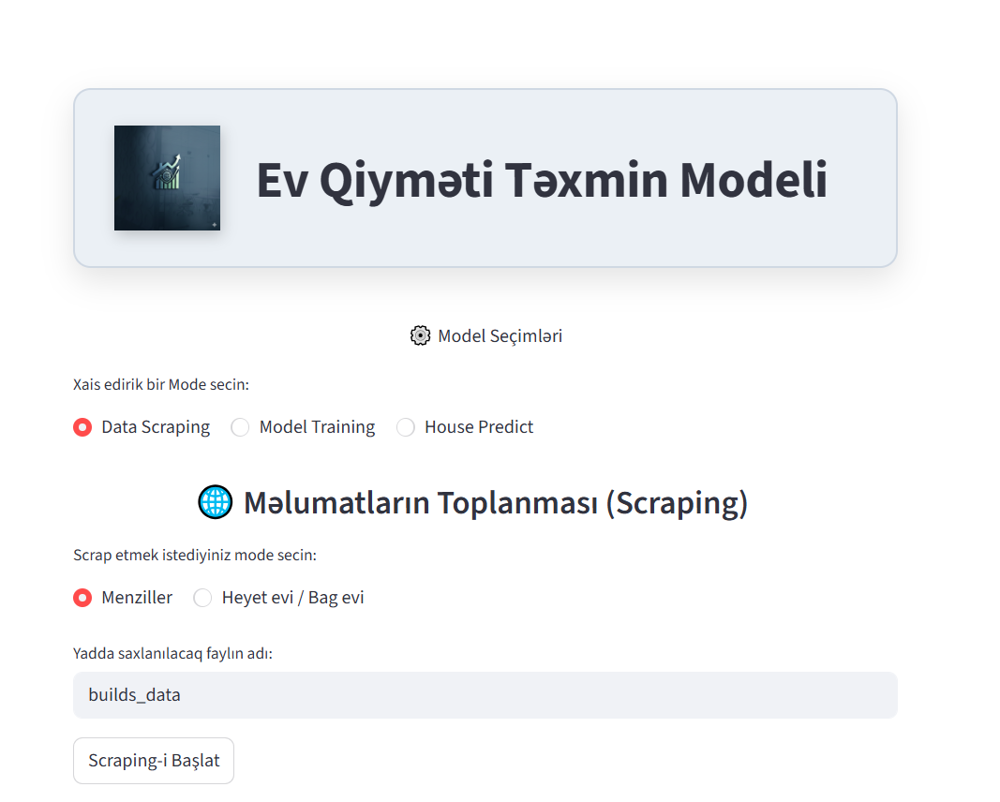

# 🏠 End-to-End House Price Prediction System

An **end-to-end Machine Learning project** that automatically collects
real estate data from websites, processes it, and predicts house prices
through an interactive web application.

This project demonstrates the **full Data Science workflow**:

Web Scraping → Data Processing → Model Training → Interactive Prediction
App

------------------------------------------------------------------------

# ✨ Features

### 🕵️ Web Scraping

-   Dynamic scraping using **Selenium**
-   Data extraction with **BeautifulSoup**
-   Collects property information such as price, location, and features

### 🧹 Data Processing

Automated pipeline for: - Missing value handling - Feature engineering -
Data cleaning - Feature scaling

### 🤖 Machine Learning Models

Multiple models are implemented and compared: - Linear Regression -
Decision Tree Regressor - Random Forest Regressor - Support Vector
Regression (SVR)

### 📊 Streamlit Web Application

Interactive interface where users can: - Input house features - Select
machine learning models - Train models - Predict house prices


## 📸 Application Demo


------------------------------------------------------------------------

# 📂 Project Structure

    End-to-End-House-Price-Prediction
    │
    ├── data/
    ├── data_creaty/
    │   ├── data_scr.py
    │   ├── data_ext.py
    │   └── data_clean.py
    │
    ├── model/
    ├── app.py
    ├── requirements.txt
    └── README.md

------------------------------------------------------------------------

# 🛠 Tech Stack

Python\
Selenium\
BeautifulSoup\
Pandas\
NumPy\
Scikit-learn\
Streamlit\
Joblib

------------------------------------------------------------------------

# 🚀 Installation

Clone the repository:

``` bash
git clone https://github.com/DemirovResad/End-to-End-House-Price-Prediction.git
```

Install dependencies:

``` bash
pip install -r requirements.txt
```

Run the application:

``` bash
streamlit run app.py
```

------------------------------------------------------------------------

# 📊 Machine Learning Pipeline

    Web Scraping
          ↓
    Data Cleaning
          ↓
    Feature Engineering
          ↓
    Model Training
          ↓
    Prediction (Streamlit App)

------------------------------------------------------------------------

# 👨‍💻 Author

**Resad Demirov**\
AI / Machine Learning Enthusiast
